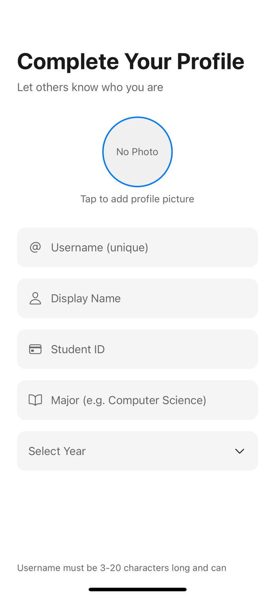

# Semster 📚

A full-stack student collaboration app that matches university students based on shared classes, major, and academic year — helping them form study groups and friendships before the semester even begins.

## The Problem
Building friendships at university is hard — especially for international and first-year students. Most students who make friends do so because they share classes, yet no platform exists to facilitate this connection intentionally. A survey of 120+ students confirmed this gap. Semster bridges it.

## Features
- 🔍 **Schedule-based matching** — find classmates by course, professor, and section
- 👥 **Study group creation** — form groups with classmates and collaborate
- 💬 **End-to-end encrypted messaging** — private and secure real-time chat
- 📅 **Meeting scheduler** — organize study sessions with RSVP functionality
- 🤝 **Friend discovery** — connect with students by major or academic year
- ❓ **Ask for Help** — post questions anonymously, get answers from classmates

## Tech Stack
- **Frontend:** React
- **Backend:** Firebase (Firestore, Authentication, Realtime Database)
- **Auth:** Secure Firebase Authentication flows

## Impact
- Tested with 120+ students across multiple rounds of user testing
- Identified and resolved key UX bottlenecks through iterative feedback
- Designed for scalability across any university, starting with SJSU

## Screenshots

| Home | Profile | Messages |
|------|---------|----------|
|  |  |  |

| Chat | Group Chat | Study Sessions |
|------|------------|----------------|
|  |  |  |

| Profile Setup | My Classes | User Profile |
|--------------|------------|--------------|
|  |  |  |

## Getting Started
```bash
npm install
npm start
```

## Built By
Shrey Pathak — EE Student at San José State University